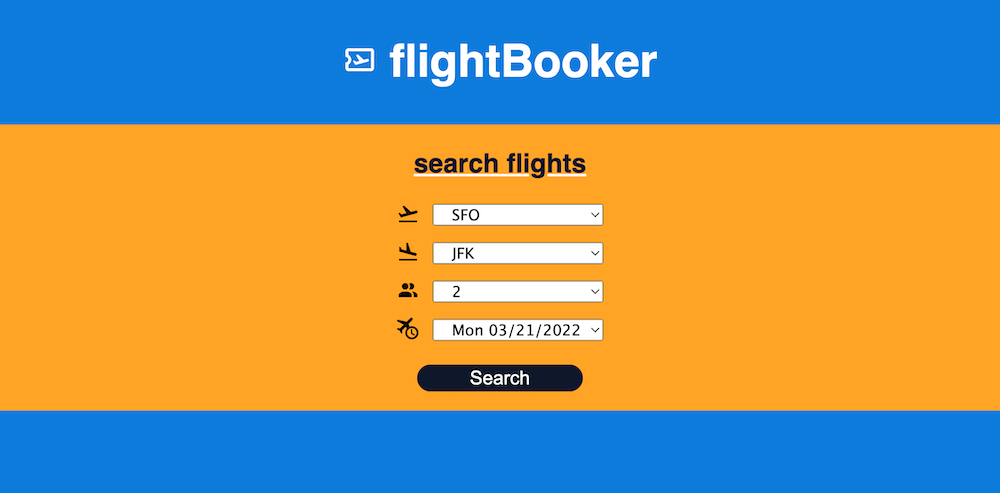

# Flight Booker

## Quick Take

[The Odin Project's](https://www.theodinproject.com/paths/full-stack-ruby-on-rails/courses/ruby-on-rails/lessons/flight-booker) Flight Booker app highlights some more advanced uses of forms in Rails. This project creates the initial steps to booking a one-way flight. 

## How it Works

Users can search available flights with a form of dropdown menus covering departing airport, arriving airport, date and number of passengers. Next users can choose from the resulting flights with another form or refine their results with a new search. Finally users can enter all the passenger information and see the resulting booking.

## Demo Online

Check out this [Flight Booker](https://intense-ocean-12420.herokuapp.com/) app running on Heroku.



## Try It Local

* Ruby version 2.7.2
* Rails version 6.1.4

```ruby
$ git clone git@github.com:dm-murphy/flight-booker.git
$ bundle install
$ rails db:migrate
$ rails db:seed
```

## What Was Learned

This project dove much deeper into Rails forms (with `select` and `collection_select`) and using nested forms. This was also good practice for seeding a database with flight data as well as formatting and stripping dates/times.

I used RSpec to incorporate model specs to confirm the date/time formatting and system specs with Capybara to run through the full use of the app for both valid and invalid selections.

For the design, I focused a bit more on web accessible colors (WCAG AA+) and font sizes to improve readability.